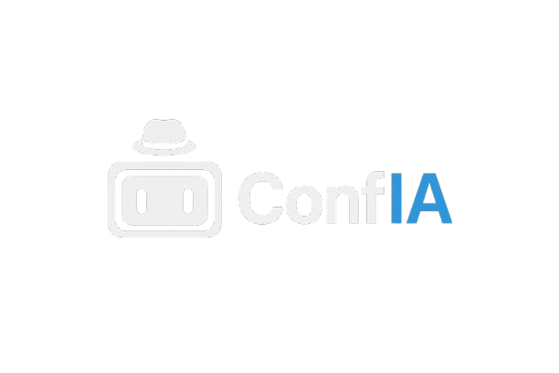

# 🧠 ConfIA — Sistema Educativo de Verificação de Fake News



O **ConfIA** (de "confiança" e "IA") é um sistema educativo inteligente de **verificação de fake news** que analisa manchetes e notícias em tempo real, usando **IA Gemini 2.0 Flash**, **APIs de notícias confiáveis** e **técnicas avançadas de detecção de desinformação**.

Ele verifica se a notícia é verdadeira, duvidosa ou sensacionalista — explicando o motivo, mostrando as fontes analisadas e fornecendo **dicas educativas** para desenvolver o pensamento crítico.

> ⚡ Projeto desenvolvido para a **Maratona Tech 2025**, unindo tecnologia, ética digital e pensamento computacional.

---

## 🚀 Funcionalidades Principais

### 🔍 Verificação Inteligente
✅ Verifica manchetes em **texto ou imagem (OCR)**  
✅ Analisa contexto com a **IA Gemini 2.0 Flash Exp**  
✅ Consulta notícias reais em **NewsData.io**  
✅ Classifica em **Alta, Média, Neutra ou Baixa Confiabilidade**  
✅ Sistema de **análise em 3 camadas** (Semântica, Comportamental, Lógica)  

### 🛡️ Detecção Avançada
✅ Detecta **linguagem sensacionalista e clickbait** (score de 0-100 pts)  
✅ Sistema de **pontuação de absurdos** para fake news perigosas (0-100 pts)  
✅ **Análise semântica contextual** com similaridade entre texto e fontes  
✅ Identificação de **teorias conspiratórias conhecidas**  
✅ Detecção de **promessas irreais e impossibilidades físicas**  

### 📊 Recursos Educativos
✅ **Dicas ConfIA** contextualizadas por nível de confiabilidade  
✅ **Histórico local** das últimas 10 verificações (persistente)  
✅ **Dashboard de estatísticas** com gráficos visuais (Chart.js)  
✅ **Gráfico de confiabilidade dinâmico** para cada análise  
✅ **Modais informativos** (Como funciona, Sobre, Histórico, Estatísticas)  
✅ **Widget de notícias reais recentes** do Brasil  

### 🎨 Interface Moderna
✅ Design inspirado em **ChatGPT e Claude**  
✅ **Modo escuro otimizado** com gradientes modernos  
✅ **Animações suaves** e feedback visual  
✅ **Responsivo** — funciona perfeitamente em desktop e mobile  
✅ **Logos das fontes** com fallback automático  

### ⚡ Otimizações Técnicas
✅ **100% Frontend** — roda direto no navegador  
✅ **Cache inteligente** (5 minutos) para otimizar requisições  
✅ **Rate limiting** (8 buscas/min, 3 OCR/min)  
✅ **Busca paralela** em múltiplas APIs  
✅ **Timeout de 8 segundos** por API com fallback  
✅ **Compressão automática de imagens** para OCR  
✅ Logs detalhados no console para debug  

---

## 💡 Como Funciona

### 🔄 Fluxo de Análise (3 Camadas)

1. **Entrada do Usuário**
   - Digitação de texto (máx 500 caracteres)
   - Upload de imagem (JPG/PNG, máx 10MB)

2. **Processamento de Entrada**
   - Validação e sanitização do texto
   - OCR para extração de texto de imagens (OCR.space)
   - Compressão automática de imagens grandes

3. **Extração de Keywords**
   - Identificação de nomes próprios
   - Filtragem de stopwords
   - Priorização por relevância

4. **Busca de Fontes**
   - NewsData.io (notícias brasileiras)
   - Cache inteligente de 5 minutos
   - Timeout de 8 segundos com fallback

5. **Análise em 3 Camadas**
   
   **🔍 Camada Semântica**
   - Cálculo de similaridade contextual (0-100%)
   - Identificação de fontes relevantes
   - Contagem de fontes tier-1 (G1, Folha, BBC, etc.)
   
   **🚨 Camada Comportamental**
   - Detecção de sensacionalismo (0-100 pts)
   - Identificação de clickbait
   - Análise de urgência artificial
   - Detecção de excesso de MAIÚSCULAS e pontuação
   
   **⚠️ Camada Lógica**
   - Detecção de absurdos (0-100 pts)
   - Identificação de promessas irreais
   - Teorias conspiratórias conhecidas
   - Impossibilidades físicas/temporais

6. **Análise com IA Gemini**
   - Interpretação contextual aprofundada
   - Geração de explicação educativa
   - Recomendações práticas
   - Manutenção da classificação rigorosa

7. **Classificação Rigorosa**
   - Sistema de pontuação multi-fatorial
   - Penalizações por sinais de alerta
   - Confiança da análise (45-95%)
   - 4 níveis de confiabilidade

8. **Feedback Visual**
   - Explicação detalhada
   - Gráfico de confiabilidade (Chart.js)
   - Fontes verificadas com logos
   - Dicas educativas contextualizadas

---


## 🧩 Pilares do Pensamento Computacional Aplicados

| Pilar | Aplicação no ConfIA v9.0 |
|-------|---------------------------|
| **Decomposição** | Sistema modular dividido em: validação, OCR, extração de keywords, busca paralela, análise em 3 camadas, classificação rigorosa, renderização visual e persistência de dados. |
| **Reconhecimento de Padrões** | Identificação avançada de sensacionalismo (10 padrões), absurdos (20 padrões), teorias conspiratórias, promessas irreais e análise semântica contextual. |
| **Abstração** | Foco em métricas essenciais: similaridade contextual, scores de confiabilidade, relevância de fontes tier-1 e confiança da análise. |
| **Algoritmo** | Sequência rigorosa e automatizada desde input até resultado final, com cache, rate limiting, fallback inteligente e sistema de penalizações multi-fatorial. |

---

## 🔄 Fluxograma do Sistema v9.0

O diagrama abaixo representa o fluxo lógico completo do **ConfIA v9.0**, incluindo as novas funcionalidades educativas:


## 🛡️ Segurança e Privacidade

### 🔒 Medidas de Segurança Implementadas
✅ **Sanitização de entrada** — remove scripts e tags HTML  
✅ **Validação rigorosa** — previne injeção de código  
✅ **Rate limiting** — previne abuso da API  
✅ **Timeouts** — evita travamentos  
✅ **Fallback automático** — garante disponibilidade  
✅ **Validação de imagens** — aceita apenas JPG/PNG  
✅ **Compressão segura** — reduz tamanho sem perda de qualidade  

### 🔐 Privacidade
✅ **Sem rastreamento** — não coletamos dados pessoais  
✅ **Sem cookies** — não usamos cookies de terceiros  
✅ **Dados locais** — histórico salvo apenas no seu navegador  
✅ **Sem cadastro** — uso 100% anônimo  
✅ **Open source** — código auditável publicamente  

---

## 🌍 Impacto Social

### 📊 Objetivos do Projeto
1. **Educação Digital** — Ensinar identificação de fake news
2. **Combate à Desinformação** — Reduzir compartilhamento de notícias falsas
3. **Pensamento Crítico** — Desenvolver habilidades analíticas
4. **Democratização** — Acesso gratuito a verificação de fatos
5. **Transparência** — Mostrar como a análise é feita

### 🎯 Público-Alvo
- 📱 **Usuários de redes sociais** — que compartilham notícias
- 🎓 **Estudantes** — aprendendo sobre mídia e jornalismo
- 👨‍🏫 **Educadores** — ensinando alfabetização digital
- 📰 **Jornalistas** — verificando informações rapidamente
- 👴 **Idosos** — grupo mais vulnerável a fake news

### 💡 Casos de Uso Educativo
1. **Em sala de aula** — Atividades de fact-checking
2. **Em workshops** — Treinamento de alfabetização midiática
3. **Em palestras** — Demonstrações práticas
4. **Em projetos** — Integração com sistemas educacionais
5. **Em pesquisas** — Estudos sobre desinformação

## 💬 FAQ (Perguntas Frequentes)

### ❓ O ConfIA é 100% preciso?
**Não.** Nenhum sistema automatizado é 100% preciso. O ConfIA é uma **ferramenta educativa** que ajuda a identificar sinais de fake news, mas a verificação final deve ser feita por humanos em fact-checkers confiáveis.

### ❓ Por que minha notícia apareceu como "Neutra"?
Notícias **muito recentes**, **regionais** ou **locais** podem não ter cobertura ampla ainda. Isso não significa que sejam falsas, apenas que não foram divulgadas amplamente.

### ❓ Posso confiar 100% nas classificações?
O ConfIA deve ser usado como **primeira análise**. Para informações críticas, sempre verifique em múltiplas fontes confiáveis e fact-checkers profissionais.

### ❓ Como o ConfIA protege minha privacidade?
Todos os dados ficam **apenas no seu navegador**. Não coletamos, armazenamos ou compartilhamos nenhuma informação pessoal.

### ❓ Posso usar o ConfIA comercialmente?
Sim! O projeto é open source (licença MIT). Você pode usar, modificar e distribuir livremente, desde que mantenha os créditos.

### ❓ Como posso contribuir?
Veja a seção **[Contribuindo](#-contribuindo)** acima. Pull requests são bem-vindos!

### ❓ O ConfIA funciona offline?
Não completamente. As APIs de notícias e IA requerem conexão. No futuro, planejamos um modo offline com cache avançado.

### ❓ Quais notícias o ConfIA consegue verificar?
O ConfIA funciona melhor com notícias de **alcance nacional/internacional**. Notícias locais, regionais ou muito recentes podem não aparecer.

### ❓ O ConfIA detecta deepfakes?
Atualmente, não. O foco é em análise textual. Detecção de deepfakes está no roadmap futuro (v10.0).

### ❓ Posso integrar o ConfIA no meu site?
No momento, não há API pública. Mas você pode embedar o site ou adaptar o código (open source). API pública está planejada para v10.0.

---

## 📞 Contato e Suporte

### 💬 Canais de Comunicação
- 📧 **Email**: hernandesneves07@gmail.com
- 💼 **LinkedIn**: www.linkedin.com/in/hernandes-sales


```

---
