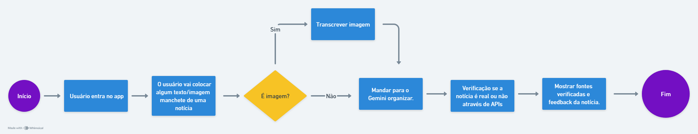
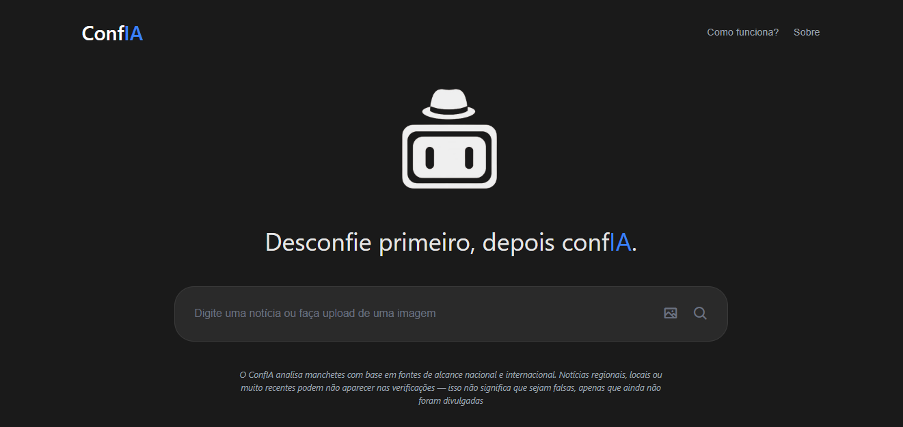
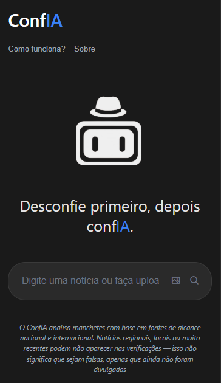

# 🧠 ConfIA — Detector Inteligente de Fake News


O **ConfIA** (de "confiança" e "IA") é um detector inteligente de **fake news** que analisa manchetes e notícias em tempo real, usando **IA Gemini** e **APIs de notícias** confiáveis.

Ele verifica se a notícia é verdadeira, duvidosa ou sensacionalista — explicando o motivo e mostrando as fontes analisadas.

> ⚡ Projeto desenvolvido para a **Maratona Tech 2025**, unindo tecnologia, ética digital e pensamento computacional.

---

## 🚀 Funcionalidades Principais

✅ Verifica manchetes em **texto ou imagem (OCR)**  
✅ Analisa o contexto com a **IA Gemini 2.0**  
✅ Consulta notícias reais em **NewsData.io e Currents API**  
✅ Classifica em **Alta, Média, Neutra ou Baixa Confiabilidade**  
✅ Detecta **linguagem sensacionalista e clickbait**  
✅ Sistema de **pontuação de absurdos** (fake news perigosas)  
✅ **Análise semântica contextual** das fontes  
✅ Mostra **fontes reais** com logos, links e datas  
✅ Interface moderna inspirada no estilo do **ChatGPT**  
✅ **100% Frontend** — roda direto no navegador  
✅ **Cache inteligente** (5 minutos) para otimizar requisições  
✅ Logs explicativos no console para debug  

---

## 💡 Como Funciona

1. O usuário insere uma **manchete ou imagem**.  
2. O sistema extrai o texto (caso seja imagem via OCR).  
3. Keywords são extraídas automaticamente do texto.  
4. **Busca paralela** em 2 APIs de notícias (NewsData.io + Currents).  
5. **Análise semântica** compara o texto original com as fontes encontradas.  
6. A **IA Gemini 2.0** interpreta contexto, linguagem e coerência.  
7. O ConfIA mostra o **nível de confiabilidade** com explicações detalhadas.  

> ⚠️ O ConfIA verifica apenas notícias amplamente divulgadas em portais nacionais e internacionais.  
> Notícias locais ou muito recentes podem não ter cobertura ainda.

---

## 🧩 Pilares do Pensamento Computacional Aplicados

| Pilar | Aplicação no ConfIA |
|-------|----------------------|
| **Decomposição** | Separação das etapas de análise: OCR, extração de keywords, APIs, análise semântica, IA e exibição dos resultados. |
| **Reconhecimento de Padrões** | Identificação de linguagem sensacionalista, clickbait, fake news perigosas e padrões contextuais nas fontes. |
| **Abstração** | Foco apenas nas informações essenciais (texto da notícia, keywords relevantes e fontes verificadas). |
| **Algoritmo** | Sequência de passos automatizados desde o input até o resultado final, com cache e fallback inteligente. |

---

## 🔄 Fluxograma do Sistema

O diagrama abaixo representa o fluxo lógico do **ConfIA**, desde a entrada do usuário até a resposta final:

<p align="center">
  
</p>

### 📘 Descrição do Fluxo:

1. **Início →** O usuário entra no site.  
2. **Entrada →** Digita uma manchete ou envia uma imagem.  
3. **OCR (se imagem) →** Extrai o texto via OCR.space e envia para o sistema.  
4. **Keywords →** Extração automática de palavras-chave relevantes.  
5. **Busca Paralela →** NewsData.io + Currents API pesquisam fontes simultaneamente.  
6. **Cache →** Verifica se a busca já foi feita recentemente (5min).  
7. **Análise Semântica →** Compara similaridade contextual entre texto original e fontes.  
8. **Detecção →** Identifica sensacionalismo, clickbait e fake news perigosas.  
9. **IA Gemini →** Analisa e gera explicação final contextualizada.  
10. **Classificação →** Define nível de confiabilidade (ALTA, MÉDIA, NEUTRA, BAIXA).  
11. **Feedback →** Exibe resultado com explicação, pontos de atenção e fontes verificadas.  
12. **Fim.**

---

## 🧰 Tecnologias Utilizadas

| Categoria | Ferramenta |
|------------|-------------|
| Frontend | HTML5, CSS3, JavaScript ES6+ (Vanilla) |
| IA | Google Gemini 2.0 Flash Exp |
| APIs de Notícias | NewsData.io, Currents API |
| OCR | OCR.space |
| Hospedagem | Netlify |
| Controle de Versão | Git + GitHub |
| Otimizações | Cache em memória, busca paralela, fallback automático |

---

## 🎯 Arquitetura do Sistema

```
┌─────────────────────────────────────────────────┐
│              FRONTEND (100%)                    │
│  HTML + CSS + JavaScript Vanilla                │
└─────────────────┬───────────────────────────────┘
                  │
    ┌─────────────┼─────────────┐
    │             │             │
    ▼             ▼             ▼
┌────────┐  ┌──────────┐  ┌──────────┐
│OCR.space│  │NewsData.io│  │Currents │
│  API    │  │   API     │  │  API    │
└────────┘  └──────────┘  └──────────┘
    │             │             │
    └─────────────┼─────────────┘
                  │
                  ▼
          ┌──────────────┐
          │  Gemini 2.0  │
          │   (Análise)  │
          └──────────────┘
                  │
                  ▼
          ┌──────────────┐
          │  Resultado   │
          │   Visual     │
          └──────────────┘
```

---

## 📊 Sistema de Análise Avançado

### 🔍 Detecção de Sensacionalismo
- Padrões de clickbait ("você não vai acreditar", "médicos odeiam")
- Linguagem urgente/alarmista
- Excesso de MAIÚSCULAS
- Pontuação: 0-100 pts

### 🚨 Detecção de Absurdos
- Promessas irreais (ganhar dinheiro fácil)
- Curas milagrosas
- Teorias conspiratórias
- Pontuação: 0-100 pts (crítico > 50pts)

### 🎯 Análise Contextual
- Similaridade semântica: compara texto original com fontes
- Relevância das fontes: verifica se falam do mesmo assunto
- Classificação: HIGH, MEDIUM, LOW, NONE

### 📈 Classificação Final
| Nível | Critérios |
|-------|-----------|
| **ALTA** | 3+ fontes tier-1 + alta similaridade contextual |
| **MÉDIA** | 2+ fontes + relevância moderada OU sensacionalismo leve |
| **NEUTRA** | 1 fonte OU sem fontes mas sem sinais de alerta |
| **BAIXA** | Absurdos críticos OU sensacionalismo extremo sem fontes |

---

## 📸 Interface

<p align="center">
  
   
</p>

---

## 🔗 Link do Projeto

🌐 **[ConfIA - Acesse aqui](https://conf-ia.netlify.app/)**

---

## ⚙️ Limites e Otimizações

### 📊 Limites das APIs (Plano Gratuito)
- **NewsData.io**: 200 requisições/dia
- **Currents API**: 600 requisições/dia
- **Gemini API**: ~1500 requisições/dia
- **OCR.space**: 25.000 requisições/mês

### 🚀 Otimizações Implementadas
- ✅ **Cache de 5 minutos**: evita requisições duplicadas
- ✅ **Busca paralela**: NewsData + Currents ao mesmo tempo
- ✅ **Fallback automático**: se uma API falhar, continua com a outra
- ✅ **Rate limiting frontend**: máximo 10 buscas/minuto por usuário
- ✅ **Compressão de imagens**: reduz tamanho antes do OCR

---

## 🛠️ Como Rodar Localmente

```bash
# Clone o repositório
git clone https://github.com/seu-usuario/confia.git

# Entre na pasta
cd confia

# Abra o index.html no navegador
# Ou use um servidor local como Live Server (VS Code)
```

> **Nota**: Não precisa instalar dependências — é 100% frontend!

---

## 📝 Estrutura do Projeto

```
confia/
├── index.html          # Página principal
├── styles.css          # Estilos globais
├── script.js           # Lógica principal (v6.0)
├── public/
│   └── screenshots/    # Imagens do README
└── README.md           # Documentação
```

